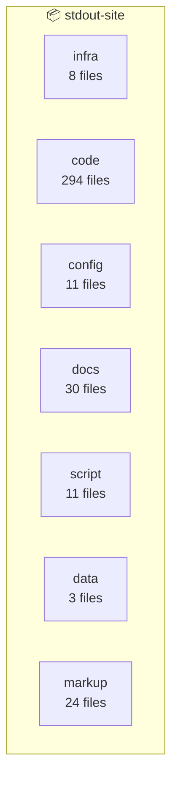
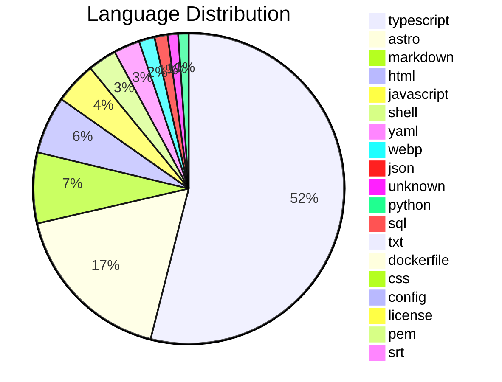

# Architecture Diagram: stdout-site

**Files:** 381 | **Complexity:** large

## Project Structure



## Languages



## File Tree

```
.DS_Store
.dockerignore
.env.example
.github/
  dependabot.yml
.github/
    docker-publish.yml
.github/
    release.yml
.mcp.json
AUTOMATION_PLAN.md
BUILD.md
COMPLETE_AUTOMATION_SUMMARY.md
Dockerfile
INSTALL.md
KNOWN_ISSUES.md
LICENSE-VALIDATION.md
astro.config.mjs
check-scanner-state.js
community-seed/
  01-cloudflare-tunnel-setup.md
community-seed/
  02-nginx-proxy-manager-new-service.md
community-seed/
  03-docker-healthcheck-patterns.md
community-seed/
  04-sqlite-backup-strategy.md
community-seed/
  05-authentik-oidc-integration.md
community-seed/
  06-telegraf-influxdb-grafana-monitoring.md
community-seed/
  07-postmortem-dns-propagation-outage.md
community-seed/
  08-postmortem-docker-compose-secrets.md
community-seed/
  09-n8n-workflow-backup-restore.md
community-seed/
  10-runbook-new-subdomain-end-to-end.md
demo.license
deploy.example.yaml
docker-compose.observatory.yml
docker-compose.yml
docs/
  QA-Setup-Walkthrough-Report.md
docs/
  monitoring-installation.md
drizzle.config.ts
install.sh
keys/
  license-public.pem
migrations/
  0010_add_observatory_learning_layer.sql
migrations/
  0011_add_data_sources_table.sql
migrations/
  0011_seed_observatory_patterns.ts
migrations/
  006_error_log.sql
mockups/
  dashboard.html
mockups/
  landing.html
mockups/
  logos.html
mockups/
  new-incident.html
mockups/
  product-logos.html
mockups/
  project-status-exec-summary.html
mockups/
  seaynic-labs-badge-v2.html
mockups/
  seayniclabs-coming-soon.html
mockups/
  stdout-coral-v2.html
mockups/
  stdout-coral.html
mockups/
  stdout-dashboard-v2.html
```
